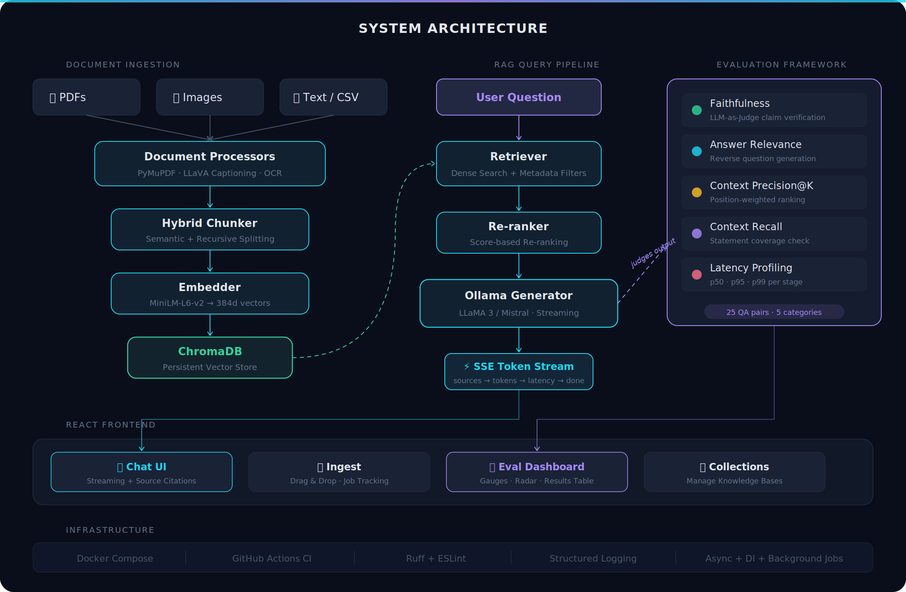

<h1 align="center">
  <br>
  
  <br>
  MRAG — Multi-Modal RAG Pipeline
  <br>
</h1>

<p align="center">
  <strong>A production-grade Retrieval-Augmented Generation system that ingests text, PDFs, and images, answers questions with cited sources via real-time streaming, and benchmarks itself with a built-in 5-metric evaluation framework.</strong>
</p>

<p align="center">
  <em>Built from scratch. No LangChain. No LlamaIndex. No paid APIs. Runs 100% locally.</em>
</p>

<p align="center">
  
  
  
  
  
  
</p>

---

## Why This Exists

Most RAG projects on GitHub are 50-line LangChain wrappers that call OpenAI and cross their fingers. They don't handle images. They don't know when they're hallucinating. They break the moment you try to run them.

**MRAG is different.** Every component — document processing, chunking, retrieval, re-ranking, generation, evaluation — is built from first principles. It processes PDFs, images, and text. It streams answers token-by-token with source citations. And it grades its own accuracy with a five-metric evaluation framework that measures faithfulness, relevance, precision, recall, and latency.

The entire stack runs locally on your machine via Ollama. No API keys. No cloud dependencies. Clone it, run it, and it works.

---

## Architecture

<p align="center">
  
</p>

---

## Features

### Multi-Modal Document Processing
Upload PDFs, images, text files, and CSVs. PDFs are parsed page-by-page with PyMuPDF — embedded images are extracted and captioned by LLaVA via Ollama. Scanned PDFs without extractable text automatically fall back to Tesseract OCR. Images get detailed captions describing visible text, charts, diagrams, and data.

### Hybrid Semantic Chunking
Documents are split using a two-stage strategy: semantic chunking groups consecutive sentences whose embeddings exceed a cosine similarity threshold (default 0.75), preserving topic coherence. Chunks that exceed the token limit are recursively split on paragraph, sentence, and word boundaries. A 10% overlap between chunks maintains context at boundaries.

### Retrieval with Re-ranking
Queries are embedded with `sentence-transformers/all-MiniLM-L6-v2` and matched against ChromaDB via dense cosine similarity. The top-K candidates are then re-ranked by score for precision. Metadata filtering lets you scope searches to specific documents or content types.

### Streaming Generation with Source Citations
Answers stream token-by-token via Server-Sent Events. The prompt instructs the LLM to cite sources by index and to explicitly say "I don't have enough information" when context is insufficient. The SSE protocol delivers events in order: sources first (so the UI can render them while generation happens), then tokens, then a latency breakdown.

### Built-in Evaluation Framework
Five automated metrics assess pipeline quality on a 25-question eval dataset spanning factual, multi-hop, image-based, comparative, adversarial, and unanswerable categories:

| Metric | Method | What It Measures |
|--------|--------|------------------|
| **Faithfulness** | LLM-as-judge claim extraction + verification | Are claims supported by retrieved context? |
| **Answer Relevance** | Reverse question generation + embedding similarity | Does the answer address what was asked? |
| **Context Precision** | Position-weighted relevance matching | Are the top-ranked retrieved chunks useful? |
| **Context Recall** | Statement-level coverage check | Was all required information retrieved? |
| **Latency** | Per-stage profiling (p50 / p95 / p99) | Is the system fast enough? |

### Production Patterns
Async FastAPI with dependency injection. Background job processing for ingestion. Structured logging with structlog. Retry logic with exponential backoff for Ollama connectivity. Docker Compose orchestration. GitHub Actions CI with linting and tests.

---

## Tech Stack

| Layer | Technology | Why |
|-------|-----------|-----|
| **LLM** | Ollama (LLaMA 3 / Mistral) | Local, free, no API keys, swappable models |
| **Vision** | LLaVA via Ollama | Multi-modal image understanding |
| **Embeddings** | sentence-transformers/all-MiniLM-L6-v2 | Fast, accurate, 384-dim vectors |
| **Vector DB** | ChromaDB (persistent) | Simple, local, no infrastructure overhead |
| **Backend** | FastAPI (async) | Auto-generated OpenAPI docs, SSE support, DI |
| **Frontend** | React 18 + TypeScript + Tailwind | Type-safe, modern, fast |
| **Evaluation** | Custom (RAGAS-inspired) | Full control, no black-box dependencies |
| **Infra** | Docker Compose + GitHub Actions | One-command setup, CI/CD |

---

## Quick Start

**Prerequisites:** Docker and Docker Compose installed. A machine with at least 8GB RAM (16GB recommended for running LLMs).

```bash
# 1. Clone
git clone https://github.com/Praneeth1636/MRAG.git
cd MRAG

# 2. Setup — pulls Ollama models (llama3, mistral, llava), installs deps
make setup

# 3. Start everything
make dev
```

The frontend will be at **http://localhost:5173** and the API docs at **http://localhost:8000/docs**.

### Without Docker (local development)

```bash
# Terminal 1 — start Ollama separately
ollama serve

# Terminal 2 — backend
cd backend
pip install -e ".[dev]"
RAG_OLLAMA_BASE_URL=http://localhost:11434 uvicorn app.main:app --reload --port 8000

# Terminal 3 — frontend
cd frontend
npm ci
npm run dev
```

---

## Project Structure

```
MRAG/
├── backend/
│   ├── app/
│   │   ├── api/                    # FastAPI routes + dependency injection
│   │   │   └── routes/             # health, ingest, query, evaluate, collections
│   │   ├── core/                   # RAG pipeline components
│   │   │   ├── chunker.py          # Hybrid semantic + recursive chunking
│   │   │   ├── embedder.py         # Sentence-transformers wrapper
│   │   │   ├── retriever.py        # ChromaDB retrieval + re-ranking
│   │   │   ├── generator.py        # Ollama generation + streaming
│   │   │   ├── rag_pipeline.py     # End-to-end orchestration
│   │   │   └── document_processor.py
│   │   ├── processors/             # Multi-modal document handlers
│   │   │   ├── pdf_processor.py    # PyMuPDF + LLaVA captioning + OCR fallback
│   │   │   ├── image_processor.py  # LLaVA image captioning via base64
│   │   │   └── text_processor.py   # Text, markdown, CSV handling
│   │   ├── evaluation/             # 5-metric eval framework
│   │   │   ├── metrics/            # faithfulness, relevance, precision, recall, latency
│   │   │   ├── evaluator.py        # Orchestrator
│   │   │   ├── report.py           # JSON + Markdown report generator
│   │   │   └── datasets/           # 25-question eval dataset
│   │   └── models/                 # Pydantic schemas
│   └── tests/
│
├── frontend/
│   └── src/
│       ├── components/             # NavRail, AppShell, Badge, ToastLayer
│       ├── pages/                  # Chat, Ingest, Eval, Collections
│       ├── stores/                 # Zustand (chat state, toasts)
│       └── lib/                    # API client, SSE helper
│
├── docker-compose.yml              # Backend + Frontend + Ollama
├── Makefile                        # setup, dev, test, lint, build, clean
└── .github/workflows/ci.yml       # Lint + test on every push
```

---

## API Endpoints

Start the backend and visit **http://localhost:8000/docs** for interactive Swagger documentation.

| Method | Endpoint | Description |
|--------|----------|-------------|
| `POST` | `/api/v1/ingest` | Upload and process documents (returns job ID) |
| `GET` | `/api/v1/ingest/{job_id}` | Check ingestion job progress |
| `POST` | `/api/v1/query` | Query with optional SSE streaming |
| `POST` | `/api/v1/evaluate` | Run the 5-metric evaluation suite |
| `GET` | `/api/v1/evaluate/{job_id}` | Get evaluation results |
| `GET` | `/api/v1/collections` | List all collections with document counts |
| `DELETE` | `/api/v1/collections/{name}` | Delete a collection |
| `GET` | `/api/v1/health` | Service health (Ollama + ChromaDB status) |

### SSE Streaming Protocol

The `/query` endpoint with `stream: true` delivers events in this order:

```
event: source    → retrieved chunk (repeated for each source)
event: token     → generated token (repeated as LLM generates)
event: latency   → {retrieval_ms, generation_ms, total_ms}
event: done      → stream complete
```

---

## Evaluation Dataset

The built-in eval dataset contains **25 Q&A pairs** across 5 categories and 4 difficulty levels:

| Category | Count | Examples |
|----------|-------|---------|
| Factual | 9 | "What embedding model is used?" "What is the default top-K?" |
| Multi-hop | 4 | "How many models can run concurrently given GPU specs?" |
| Image-based | 3 | "What does the architecture diagram show about data flow?" |
| Unanswerable | 5 | "What is the company's Q4 revenue?" (not in docs) |
| Comparative | 4 | "How does semantic chunking compare to fixed-size?" |

Includes **2 adversarial prompt injection tests** to verify the system refuses manipulation.

---

## Available Commands

```bash
make help           # Show all commands
make setup          # Pull models + install dependencies
make dev            # Start all services (hot reload)
make dev-backend    # Backend + Ollama only
make dev-frontend   # Frontend only
make test           # Run all tests
make lint           # Ruff + mypy + ESLint
make format         # Auto-format all code
make build          # Production Docker build
make up             # Start in background
make down           # Stop everything
make clean          # Remove containers, volumes, artifacts
make logs           # Tail all service logs
```

---

## Design Decisions

**Why no LangChain / LlamaIndex?**
Building from scratch demonstrates understanding of how retrieval, chunking, and generation actually work — not just how to call a library. Every component is inspectable, testable, and replaceable.

**Why local-only with Ollama?**
No API keys means anyone can clone and run this in minutes. No data leaves your machine. Supports both LLaMA 3 and Mistral with a single config change.

**Why build evaluation from scratch?**
Most RAG projects have no evaluation at all. Building the metrics (faithfulness via LLM-as-judge, relevance via reverse question generation) shows research-level thinking applied to a practical system.

**Why ChromaDB over Pinecone/Weaviate?**
Zero infrastructure overhead. Persistent local storage. Perfect for a self-contained project that recruiters can actually run.

---

## Future Improvements

- [ ] Cross-encoder re-ranking with `ms-marco-MiniLM-L-6-v2`
- [ ] Redis-backed job queue replacing in-memory store
- [ ] Multi-turn conversation memory
- [ ] Hybrid BM25 + dense retrieval
- [ ] Support for `.docx` and `.pptx` files
- [ ] Kubernetes deployment manifests
- [ ] A/B testing for prompt variants
- [ ] Confidence-calibrated answer scores
- [ ] Automatic eval dataset generation from ingested docs

---

## License

[MIT](LICENSE) — use it however you want.

---

<p align="center">
  <sub>4,400+ lines of Python and TypeScript · 25 eval Q&A pairs · 5 automated metrics · 0 paid APIs</sub>
</p>
